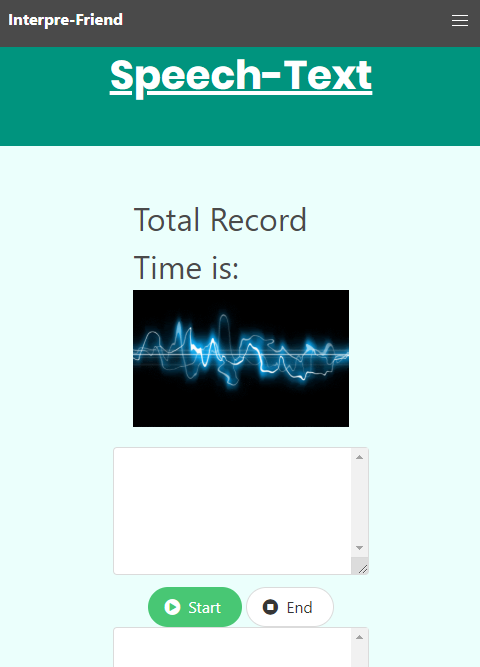

# Project 1

>Speech-Text - User speech is recorded, transcribed, and translated

>A user can use the microphone to record speech in English, which will be transcribed and translated into German.

Microsoft Speech Recognition and Microsoft Translator v3.00 are used to accomplish these tasks.

[Speech-Text-Translator](https://jpanakkal22.github.io/team_project_1/)

